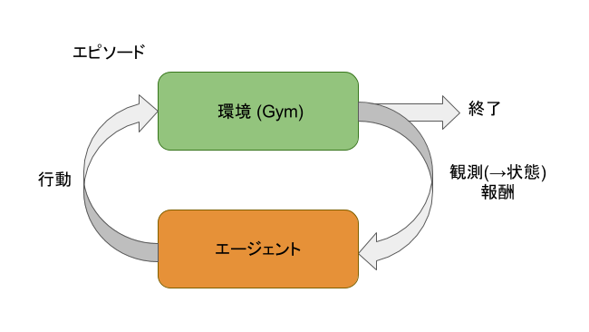

# 概要

このハンズオンでは、OpenAI Gymを利用して、強化学習を体験していきます。

## 強化学習とは

強化学習(Reinforcement Learning)とは、機械学習の一つの分野であり、エージェントが環境内で報酬を最大にしていくためにどのような行動を取るべきか、という問題を扱う。
主な構成要素は環境とエージェントであり、以下の図のような関係にある。



今回、環境については OpenAI Gym により提供されている。
エージェントは環境を観測できるので、環境からエージェントには観測結果(observation)が渡される。
エージェントは観測結果から環境の状態を判断し、その状態に応じた行動(action)を実行する。
環境ではその行動を元に環境の状態が変化して、環境からエージェントには観測結果と行動に対する報酬(reward)が渡される。
この1サイクルが1ステップとなる。
環境が完了状態になるまで、上記の処理を繰り返すことになり、1つのエピソードが完了する。

たとえば、スペースインベーダーのゲームで考えると、操作するキャラクターがエージェントになり、ゲーム自体が環境になります。
操作するキャラクターを移動したり、攻撃したり、することで環境に変化が起こり、変化後の環境情報が観測結果としてエージェントに渡されてきます。
ゲームが終了するまでが1つのエピソードになります。

## OpenAI Gym

OpenAI Gymは強化学習のを開発・評価するためのツールキットである。
強化学習の課題をシンプルなインターフェースでアクセスすることができる。
たとえば、Pythonで以下のような感じのコードを記述すれば、とりあえず、動かすことはできる。

```
import gym
env = gym.make("Taxi-v1")
observation = env.reset()
for _ in range(1000):
  env.render()
  action = env.action_space.sample() # your agent here (this takes random actions)
  observation, reward, done, info = env.step(action)
```

実行結果をOpenAIのサイトにアップロードすることもでき、他の人の作ったものなどとも比較したりすることもできる。

## Gym Starter Kit

OpenAI Gymを利用することで、強化学習を体験することができるが、上記のコード例にもあるように、環境からエージェントまでのすべてのコードを実装する必要がある。
強化学習のアルゴリズムの開発は基本的にはエージェントをどうするべきかを考えることになるので、Gym Starter Kitではエージェントだけの開発に注力すれば良い開発環境を提供する。
つまり、環境に関する実装はGym Starter Kitが提供して、エージェントだけを実装すれば、OpenAI Gymが提供する環境を簡単に利用することができるようになる。

